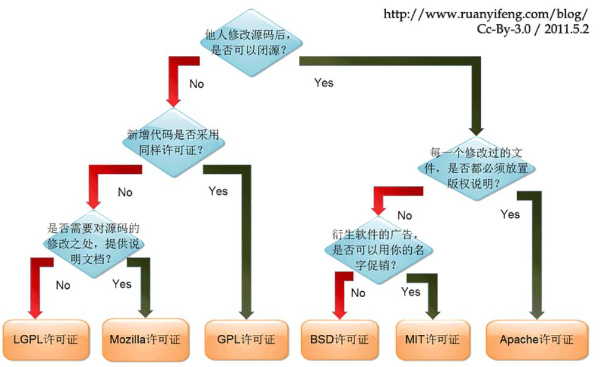
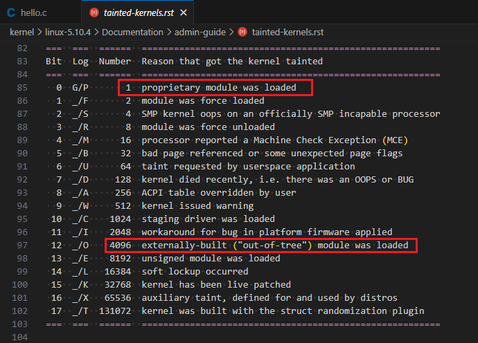
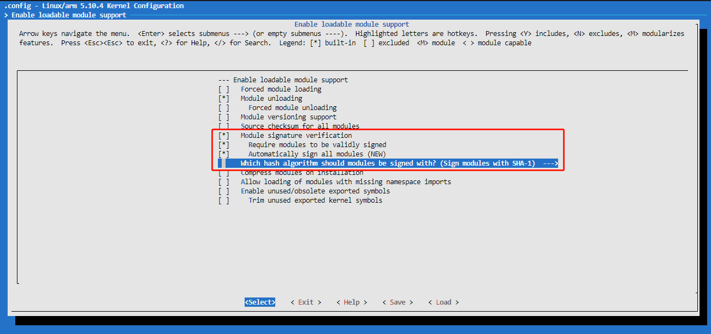

# 1. 可加载模块
## 1.1 Linux内核的模块机制
- LKM：Loadable Kernel Module
内核模块化、高度可定制化和裁剪
适配不同的架构、硬件平台
支持运行时动态加载或卸载一个模块
不需要重新编译、重启内核
## 1.2 实验：hello模块
- 目标：
一个内核模块的编译和运行，动态加载、动态卸载。
1. 添加hello.c文件，路径和内容如下：
```shell
ubuntu@VM-8-3-ubuntu:~/wuxiang/code_folder$ cd kernel/drivers/00hello/
ubuntu@VM-8-3-ubuntu:~/wuxiang/code_folder/kernel/drivers/00hello$ pwd
/home/ubuntu/wuxiang/code_folder/kernel/drivers/00hello
ubuntu@VM-8-3-ubuntu:~/wuxiang/code_folder/kernel/drivers/00hello$ ls hello.c
hello.c
ubuntu@VM-8-3-ubuntu:~/wuxiang/code_folder/kernel/drivers/00hello$ 
```
```c
#include <linux/init.h>
#include <linux/module.h>

static int __init hello_init(void)
{
    printk("Hello world\n");
    return 0;
}

static void __exit hello_exit(void)
{
    printk("Goodbye world\n");
}

module_init(hello_init);
module_exit(hello_exit);

// MODULE_LICENSE("GPL");
MODULE_AUTHOR("uwu16");
```
```Makefile
.PHONY : all clean

obj-m := hello.o

EXTRA_CFLAGS += -DDEBUG
# KDIR := ${PWD}/../../linux-5.10.4

all:
	make -C $(KDIR) M=$(PWD) modules
# clean:
# 	make -C $(KDIR) M=$(PWD) modules clean

clean:
	@rm -rf *.o *~ .depend .*.cmd  *.mod *.mod.c .tmp_versions *.ko *.symvers modules.order
```
2. 到代码根目录进入build目录下：
```shell
sudo cmake ..
sudo make kernel drivers rootfs
```
3. 到代码根目录下进入out目录下：
```shell
sudo ./start.sh
```
得到实验结果：
```shell
[root@vexpress drivers]# pwd
/my_data/drivers
[root@vexpress drivers]# ls
hello.ko
[root@vexpress drivers]# insmod hello.ko
hello: loading out-of-tree module taints kernel.
hello: module license 'unspecified' taints kernel.
Disabling lock debugging due to kernel taint
Hello world
[root@vexpress drivers]# lsmod
hello 16384 0 - Live 0x7f000000 (PO)
[root@vexpress drivers]# rmmod hello.ko
Goodbye world
[root@vexpress drivers]#
```
## 1.3 内核模块的构成
- hello_init
	- 模块加载入口函数，主要完成模块初始化工作
	- 使用 __init声明，使用module_init指定
	- 模块被加载到内核时，入口函数自动被内核执行
	- 返回值：errno
	- 应用层可根据返回值，使用 perror 进行解析
- hello_exit
	- 模块卸载函数，模块卸载时该函数自动被内核执行
	- 使用 __exit声明，使用module_exit指定
	- 主要完成结束模块运行的相关工作、清理各种资源
	- 返回类型：void
- insmod
- lsmod
- rmmod
2. 内核许可声明
用来描述内核的许可权限：内核以GPL发布
模块不声明LICENSE，内核会有(kernel tainted)警告
内核状态此时是受污染的（dirty）
内核受污染后，一些调试、打印功能可能会失效
## 2.1 协议分类


## 2.2 内核污染（kernel tainted）
### 2.2.1 cat /proc/sys/kernel/tainted
```shell
[root@vexpress ]# cat /proc/sys/kernel/tainted 
0
[root@vexpress ]# cd my_data/drivers/
[root@vexpress drivers]# 
[root@vexpress drivers]# 
[root@vexpress drivers]# ls
hello.ko
[root@vexpress drivers]# insmod hello.ko 
hello: loading out-of-tree module taints kernel.
hello: module license 'unspecified' taints kernel.
Disabling lock debugging due to kernel taint
Hello world
[root@vexpress drivers]# cat /proc/sys/kernel/tainted 
4097
[root@vexpress drivers]# 
```
### 2.2.2 内核被污染的原因


# 3. 模块签名机制
1. 在make_kernel.sh中添加：make menuconfig
```shell
ubuntu@VM-8-3-ubuntu:~/wuxiang/code_folder/kernel$ git diff make_kernel.sh
diff --git a/kernel/make_kernel.sh b/kernel/make_kernel.sh
index 7434ede7e..bc8ff3ef6 100755
--- a/kernel/make_kernel.sh
+++ b/kernel/make_kernel.sh
@@ -17,6 +17,7 @@ make_kernel() {
     cd ./linux-5.10.4
     # make clean
     make vexpress_defconfig
+    make menuconfig
     make zImage -j8
     make modules -j8
     make dtbs -j8
ubuntu@VM-8-3-ubuntu:~/wuxiang/code_folder/kernel$ 
```
2. 打开如下选项：
```
CONFIG_MODULE_SIG
CONFIG_MODULE_SIG_FORCE
CONFIG_MODULE_SIG_ALL
```

3. 未签名的 hello.ko
```shell
[root@vexpress drivers]# insmod hello.ko 
hello: Loading of unsigned module is rejected
insmod: can't insert 'hello.ko': Key was rejected by service
[root@vexpress drivers]# 
```
4. 查看签名需要的文件：
```shell
ubuntu@VM-8-3-ubuntu:~/wuxiang/code_folder/kernel/linux-5.10.4/certs$ ls signing_key.*
signing_key.pem  signing_key.x509
ubuntu@VM-8-3-ubuntu:~/wuxiang/code_folder/kernel/linux-5.10.4/certs$ 
```
- certs/signing_key.x509 公钥
- certs/signing_key.pem 私钥
- scripts/sign-file 签名工具
```shell
ubuntu@VM-8-3-ubuntu:~/wuxiang/code_folder/kernel/linux-5.10.4/scripts$ ls sign-*
sign-file  sign-file.c
ubuntu@VM-8-3-ubuntu:~/wuxiang/code_folder/kernel/linux-5.10.4/scripts$ 
```
5. 手工给模块签名
（1）签名前：
```shell
ubuntu@VM-8-3-ubuntu:~/wuxiang/code_folder/kernel/drivers/00hello$ hexdump -C hello.ko | tail
00014990  00 00 00 00 00 00 00 00  01 00 00 00 00 00 00 00  |................|
000149a0  01 00 00 00 02 00 00 00  00 00 00 00 00 00 00 00  |................|
000149b0  74 f9 00 00 50 03 00 00  26 00 00 00 30 00 00 00  |t...P...&...0...|
000149c0  04 00 00 00 10 00 00 00  09 00 00 00 03 00 00 00  |................|
000149d0  00 00 00 00 00 00 00 00  c4 fc 00 00 e3 00 00 00  |................|
000149e0  00 00 00 00 00 00 00 00  01 00 00 00 00 00 00 00  |................|
000149f0  11 00 00 00 03 00 00 00  00 00 00 00 00 00 00 00  |................|
00014a00  40 42 01 00 97 01 00 00  00 00 00 00 00 00 00 00  |@B..............|
00014a10  01 00 00 00 00 00 00 00                           |........|
00014a18
ubuntu@VM-8-3-ubuntu:~/wuxiang/code_folder/kernel/drivers/00hello$ 
```
（2）签名：
```shell
ubuntu@VM-8-3-ubuntu:~/wuxiang/code_folder/kernel/drivers/00hello$ sudo ../../linux-5.10.4/scripts/sign-file sha1 ../../linux-5.10.4/certs/signing_key.pem ../../linux-5.10.4/certs/signin
g_key.x509 hello.ko 
ubuntu@VM-8-3-ubuntu:~/wuxiang/code_folder/kernel/drivers/00hello$ 
```
（3）签名后：
```shell
ubuntu@VM-8-3-ubuntu:~/wuxiang/code_folder/kernel/drivers/00hello$ hexdump -C hello.ko | tail
00014c60  ac 93 36 2e 7c 67 a1 e5  3d 8f 5f bb 82 3b 2e 3a  |..6.|g..=._..;.:|
00014c70  80 01 38 34 3f 07 46 60  06 43 68 3b 8f 7c 61 c8  |..84?.F`.Ch;.|a.|
00014c80  97 38 9b 34 a0 dd bd ba  53 bc 03 12 cf a1 a5 77  |.8.4....S......w|
00014c90  81 ee d4 78 17 d2 44 23  cb 68 2f fe 37 79 77 04  |...x..D#.h/.7yw.|
00014ca0  71 b7 6d b9 63 40 20 70  ba e6 52 a8 d0 72 e0 0b  |q.m.c@ p..R..r..|
00014cb0  ed 74 9f 07 3e be ef 35  0b 00 00 02 00 00 00 00  |.t..>..5........|
00014cc0  00 00 00 02 a1 7e 4d 6f  64 75 6c 65 20 73 69 67  |.....~Module sig|
00014cd0  6e 61 74 75 72 65 20 61  70 70 65 6e 64 65 64 7e  |nature appended~|
00014ce0  0a                                                |.|
00014ce1
ubuntu@VM-8-3-ubuntu:~/wuxiang/code_folder/kernel/drivers/00hello$ 
```
6. 签名的hello.ko
拷贝签名的hello.ko到out目录下，执行sudo make rootfs，将其编译到文件系统中，然后启动qemu。
```shell
[root@vexpress drivers]# insmod hello.ko 
hello: loading out-of-tree module taints kernel.
hello: module license 'unspecified' taints kernel.
Disabling lock debugging due to kernel taint
Hello world
[root@vexpress drivers]# 
```
7. 补充：清除模块签名

```shell
ubuntu@VM-8-3-ubuntu:~/wuxiang/code_folder/kernel/drivers/00hello$ hexdump -C hello.ko | tail
00014c60  ac 93 36 2e 7c 67 a1 e5  3d 8f 5f bb 82 3b 2e 3a  |..6.|g..=._..;.:|
00014c70  80 01 38 34 3f 07 46 60  06 43 68 3b 8f 7c 61 c8  |..84?.F`.Ch;.|a.|
00014c80  97 38 9b 34 a0 dd bd ba  53 bc 03 12 cf a1 a5 77  |.8.4....S......w|
00014c90  81 ee d4 78 17 d2 44 23  cb 68 2f fe 37 79 77 04  |...x..D#.h/.7yw.|
00014ca0  71 b7 6d b9 63 40 20 70  ba e6 52 a8 d0 72 e0 0b  |q.m.c@ p..R..r..|
00014cb0  ed 74 9f 07 3e be ef 35  0b 00 00 02 00 00 00 00  |.t..>..5........|
00014cc0  00 00 00 02 a1 7e 4d 6f  64 75 6c 65 20 73 69 67  |.....~Module sig|
00014cd0  6e 61 74 75 72 65 20 61  70 70 65 6e 64 65 64 7e  |nature appended~|
00014ce0  0a                                                |.|
00014ce1
ubuntu@VM-8-3-ubuntu:~/wuxiang/code_folder/kernel/drivers/00hello$ strip --strip-debug hello.ko
strip: Unable to recognise the format of the input file `hello.ko'   
ubuntu@VM-8-3-ubuntu:~/wuxiang/code_folder/kernel/drivers/00hello$ ../../../toolchain/gcc-linaro-7.5.0-2019.12-x86_64_arm-linux-gnueabi/bin/arm-linux-gnueabi-strip --strip-debug hello.ko
ubuntu@VM-8-3-ubuntu:~/wuxiang/code_folder/kernel/drivers/00hello$ hexdump -C hello.ko | tail
00000ce0  00 00 00 00 00 00 00 00  01 00 00 00 00 00 00 00  |................|
00000cf0  01 00 00 00 02 00 00 00  00 00 00 00 00 00 00 00  |................|
00000d00  00 04 00 00 b0 02 00 00  1a 00 00 00 26 00 00 00  |............&...|
00000d10  04 00 00 00 10 00 00 00  09 00 00 00 03 00 00 00  |................|
00000d20  00 00 00 00 00 00 00 00  b0 06 00 00 cf 00 00 00  |................|
00000d30  00 00 00 00 00 00 00 00  01 00 00 00 00 00 00 00  |................|
00000d40  11 00 00 00 03 00 00 00  00 00 00 00 00 00 00 00  |................|
00000d50  e0 07 00 00 28 01 00 00  00 00 00 00 00 00 00 00  |....(...........|
00000d60  01 00 00 00 00 00 00 00                           |........|
00000d68
ubuntu@VM-8-3-ubuntu:~/wuxiang/code_folder/kernel/drivers/00hello$ 
```

# 4. 将模块编译进内核
1.	代码根目录进入如下目录，新建hello.c文件（内容同上），并修改KConfig和Makefile
 
 
 
 
2.	dmesg显示开机信息：
 
完整的开机信息如下：（Hello world在110行）
 
5.out-of-tree编译
 
6.	模块的Makefile分析
Kbuild：
 
将Kbuild和Makefile分开：
 
 
7.	模块参数
7.1 如何给模块传参数？
 
	name：要传递的参数，对应模块中的全局变量
	type：要传递的参数类型，要和全局变量类型一致
	perm：读写权限
¡	/sys/module/hello/parameters/xx 参数节点
¡	0666：读写权限
¡	0444：只读权限，无法对这个文件节点执行写的操作
¡	4-读，2-写，1-执行
 
 
7.2 通过uboot给模块传参
	需要使用编译进内核中的hello模块
1.	编译uboot时，make menuconfig，在bootargs中添加hello.num=100
2.	启动qemu
 
3.	完整开机log如下：
 
8.	EXPORT_SYMBOL
8.1 用户空间的模块化编程
函数的实现：math.c/int add(int a, int b)
函数的声明：math.h/int add(int a, int b);
 
8.2 内核空间的模块化编程
模块的封装：static、EXPORT_SYMBOL
函数的声明：头文件
	按不同的协议导出符号
EXPORT_SYMBOL
EXPORT_SYMBOL_GPL
 
9.	模块的版本控制
解决内核模块和内核之间的接口一致性问题
根据函数参数、返回值类型等生成CRC校验码
当内核和模块双方的校验码相等，则为相同接口
内核启动版本控制功能：CONFIG_MODVERSIONS
 
	实验：版本控制实验
1.	不开CONFIG_MODVERSIONS编译内核，基于此内核编译drivers
2.	打开CONFIG_MODVERSIONS，不编译drivers
3.	使用打开CONFIG_MODVERSIONS的内核和不开CONFIG_MODVERSIONS编译内核后编译的drivers，进行版本控制的实验。
 
	相关的几个文件
hello_version_ctrl.mod.c
hello_version_ctrl.ko：__versions section
内核中：Modules.symvers
模块中：Modules.symvers
 
 
hello_version_ctrl.ko模块中调用的内核中的接口函数以及CRC校验码，当模块被加载到内核中运行的时候，内核就会根据调用的比如printk的校验码和内核中保存的printk的校验码进行比对，比对成功，模块才可以加载到内核中运行。
 
反汇编：
 
 
我们自己编译的模块，使用EXPORT_SYMBOL导出的时候，也会生成校验码，别的模块在调用时也会进行校验。
 
10.	模块的头文件
 
	头文件分类
内核专用头文件：include/linux
和CPU架构相关：arch/$(ARCH)/include
板级硬件相关：
arch/$(ARCH)/plat-xx/include
arch/$(ARCH)/mach-xx/include
	通过GCC -I指定头文件路径
 
 
	内核中的头文件路径
 
 
 
11.	多文件构成的模块
	编程实验：
1.	一个复杂模块往往由多个C文件构成
2.	模块内部接口的封装和引用
3.	模块如何封装
4.	模块间如何引用
5.	头文件
6.	Makefile 的写法
 
 
12.	模块间的依赖
 
	生成模块间的依赖关系
 
depmod会解析/lib/modules/$(kernel_version)下的所有内核模块，通过各个模块EXPORT_SYMBOL和引用的符号，生成一个模块依赖关系表：/lib/modules/$(kernel_version)/modules.dep
 
 
13.	编写一个字符驱动
read / write
sys_read / sys_write
普通文件	设备文件
文件系统	设备模型
inode	设备号
块设备驱动	字符设备驱动
	编程实验：实现一个最简单的字符驱动
驱动源码：实现基本的read、write接口
Makefile编写
创建设备节点
编写应用程序读写设备，看驱动工作是否正常
 
 
 
14.	模块的运行过程
	模块的分类
可加载模块：源码外编译，动态加载、动态卸载
内置模块：直接编译进内核，随内核启动初始化
	使用dump_stack()打印函数调用栈
 
 
 
15.	模块机制实现分析
	分析之前的准备
C语言与链接脚本、Makefile、Kbuild的交互
C语言如何引用链接脚本中定义的符号
C语言如何使用Makefile中定义的符号
C语言如何使用kbuild配置变量
???????????????????????????????????????????????
???????????????????????????????????????????????
???????????????????????????????????????????????
???????????????????????????????????????????????
16.	使用模块机制分析内核
  


