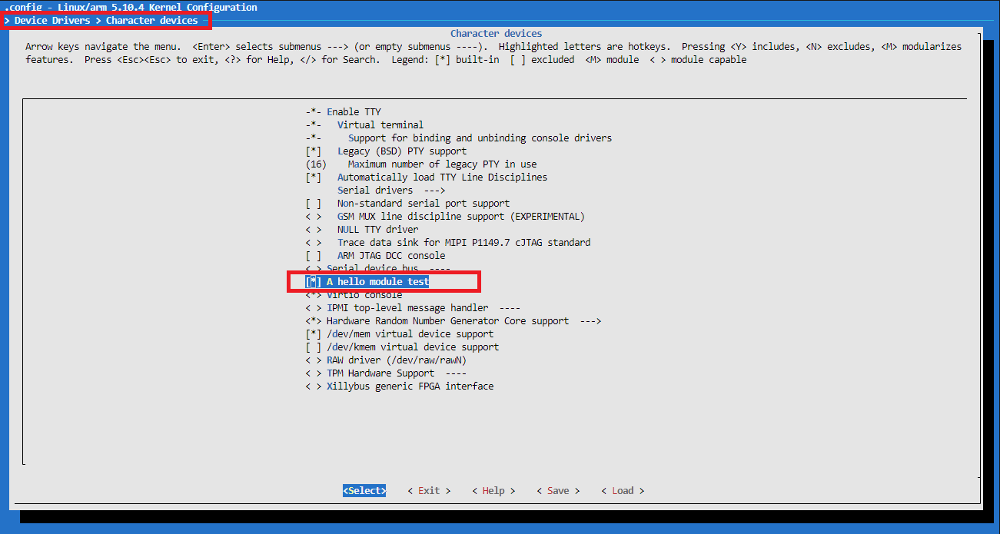

# 1. 可加载模块
## 1.1 Linux内核的模块机制
<font color=red>LKM：Loadable Kernel Module</font>

内核模块化、高度可定制化和裁剪
适配不同的架构、硬件平台
支持运行时动态加载或卸载一个模块
不需要重新编译、重启内核

## 1.2 实验：hello模块
目标：一个内核模块的编译和运行，动态加载、动态卸载。

1. 添加hello.c文件，路径和内容如下：
```shell {.line-numbers}
ubuntu@VM-8-3-ubuntu:~/wuxiang/code_folder$ cd kernel/drivers/00hello/
ubuntu@VM-8-3-ubuntu:~/wuxiang/code_folder/kernel/drivers/00hello$ pwd
/home/ubuntu/wuxiang/code_folder/kernel/drivers/00hello
ubuntu@VM-8-3-ubuntu:~/wuxiang/code_folder/kernel/drivers/00hello$ ls hello.c
hello.c
ubuntu@VM-8-3-ubuntu:~/wuxiang/code_folder/kernel/drivers/00hello$ 
```

```c {.line-numbers}
#include <linux/init.h>
#include <linux/module.h>

static int __init hello_init(void)
{
    printk("Hello world\n");
    return 0;
}

static void __exit hello_exit(void)
{
    printk("Goodbye world\n");
}

module_init(hello_init);
module_exit(hello_exit);

// MODULE_LICENSE("GPL");
MODULE_AUTHOR("uwu16");
```

```Makefile{.line-numbers}
.PHONY : all clean

obj-m := hello.o

EXTRA_CFLAGS += -DDEBUG
# KDIR := ${PWD}/../../linux-5.10.4

all:
	make -C $(KDIR) M=$(PWD) modules
# clean:
# 	make -C $(KDIR) M=$(PWD) modules clean

clean:
	@rm -rf *.o *~ .depend .*.cmd  *.mod *.mod.c .tmp_versions *.ko *.symvers modules.order
```

2. 到代码根目录进入build目录下：
```shell{.line-numbers}
sudo cmake ..
sudo make kernel drivers rootfs
```

3. 到代码根目录下进入out目录下：
```shell{.line-numbers}
sudo ./start.sh
```

得到实验结果：
```shell{.line-numbers}
[root@vexpress drivers]# pwd
/my_data/drivers
[root@vexpress drivers]# ls
hello.ko
[root@vexpress drivers]# insmod hello.ko
hello: loading out-of-tree module taints kernel.
hello: module license 'unspecified' taints kernel.
Disabling lock debugging due to kernel taint
Hello world
[root@vexpress drivers]# lsmod
hello 16384 0 - Live 0x7f000000 (PO)
[root@vexpress drivers]# rmmod hello.ko
Goodbye world
[root@vexpress drivers]#
```

## 1.3 内核模块的构成
- hello_init
	- 模块加载入口函数，主要完成模块初始化工作
	- 使用 __init 声明，使用 module_init 指定
	- 模块被加载到内核时，入口函数自动被内核执行
	- 返回值：errno
	- 应用层可根据返回值，使用 perror 进行解析
- hello_exit
	- 模块卸载函数，模块卸载时该函数自动被内核执行
	- 使用 __exit 声明，使用 module_exit 指定
	- 主要完成结束模块运行的相关工作、清理各种资源
	- 返回类型：void
- insmod
- lsmod
- rmmod

# 2. 内核许可声明
用来描述内核的许可权限：内核以GPL发布
模块不声明LICENSE，内核会有 <font color=red>(kernel tainted) 警告</font>
内核状态此时是受污染的（dirty）
内核受污染后，一些调试、打印功能可能会失效

## 2.1 协议分类


## 2.2 内核污染（kernel tainted）
### 2.2.1 cat /proc/sys/kernel/tainted
```shell{.line-numbers}
[root@vexpress ]# cat /proc/sys/kernel/tainted 
0
[root@vexpress ]# cd my_data/drivers/
[root@vexpress drivers]# 
[root@vexpress drivers]# 
[root@vexpress drivers]# ls
hello.ko
[root@vexpress drivers]# insmod hello.ko 
hello: loading out-of-tree module taints kernel.
hello: module license 'unspecified' taints kernel.
Disabling lock debugging due to kernel taint
Hello world
[root@vexpress drivers]# cat /proc/sys/kernel/tainted 
4097
[root@vexpress drivers]# 
```

### 2.2.2 内核被污染的原因


# 3. 模块签名机制
1. 在make_kernel.sh中添加：make menuconfig
```shell{.line-numbers}
ubuntu@VM-8-3-ubuntu:~/wuxiang/code_folder/kernel$ git diff make_kernel.sh
diff --git a/kernel/make_kernel.sh b/kernel/make_kernel.sh
index 7434ede7e..bc8ff3ef6 100755
--- a/kernel/make_kernel.sh
+++ b/kernel/make_kernel.sh
@@ -17,6 +17,7 @@ make_kernel() {
     cd ./linux-5.10.4
     # make clean
     make vexpress_defconfig
+    make menuconfig
     make zImage -j8
     make modules -j8
     make dtbs -j8
ubuntu@VM-8-3-ubuntu:~/wuxiang/code_folder/kernel$ 
```

2. 打开如下选项：
```{.line-numbers}
CONFIG_MODULE_SIG
CONFIG_MODULE_SIG_FORCE
CONFIG_MODULE_SIG_ALL
```


3. 未签名的 hello.ko
```shell{.line-numbers}
[root@vexpress drivers]# insmod hello.ko 
hello: Loading of unsigned module is rejected
insmod: can't insert 'hello.ko': Key was rejected by service
[root@vexpress drivers]# 
```

4. 查看签名需要的文件：
```shell{.line-numbers}
ubuntu@VM-8-3-ubuntu:~/wuxiang/code_folder/kernel/linux-5.10.4/certs$ ls signing_key.*
signing_key.pem  signing_key.x509
ubuntu@VM-8-3-ubuntu:~/wuxiang/code_folder/kernel/linux-5.10.4/certs$ 
```

- certs/signing_key.x509 公钥
- certs/signing_key.pem 私钥
- scripts/sign-file 签名工具

```shell{.line-numbers}
ubuntu@VM-8-3-ubuntu:~/wuxiang/code_folder/kernel/linux-5.10.4/scripts$ ls sign-*
sign-file  sign-file.c
ubuntu@VM-8-3-ubuntu:~/wuxiang/code_folder/kernel/linux-5.10.4/scripts$ 
```

5. 手工给模块签名
（1）签名前：
```shell{.line-numbers}
ubuntu@VM-8-3-ubuntu:~/wuxiang/code_folder/kernel/drivers/00hello$ hexdump -C hello.ko | tail
00014990  00 00 00 00 00 00 00 00  01 00 00 00 00 00 00 00  |................|
000149a0  01 00 00 00 02 00 00 00  00 00 00 00 00 00 00 00  |................|
000149b0  74 f9 00 00 50 03 00 00  26 00 00 00 30 00 00 00  |t...P...&...0...|
000149c0  04 00 00 00 10 00 00 00  09 00 00 00 03 00 00 00  |................|
000149d0  00 00 00 00 00 00 00 00  c4 fc 00 00 e3 00 00 00  |................|
000149e0  00 00 00 00 00 00 00 00  01 00 00 00 00 00 00 00  |................|
000149f0  11 00 00 00 03 00 00 00  00 00 00 00 00 00 00 00  |................|
00014a00  40 42 01 00 97 01 00 00  00 00 00 00 00 00 00 00  |@B..............|
00014a10  01 00 00 00 00 00 00 00                           |........|
00014a18
ubuntu@VM-8-3-ubuntu:~/wuxiang/code_folder/kernel/drivers/00hello$ 
```

（2）签名：
```shell{.line-numbers}
ubuntu@VM-8-3-ubuntu:~/wuxiang/code_folder/kernel/drivers/00hello$ sudo ../../linux-5.10.4/scripts/sign-file sha1 ../../linux-5.10.4/certs/signing_key.pem ../../linux-5.10.4/certs/signin
g_key.x509 hello.ko 
ubuntu@VM-8-3-ubuntu:~/wuxiang/code_folder/kernel/drivers/00hello$ 
```

（3）签名后：
```shell{.line-numbers}
ubuntu@VM-8-3-ubuntu:~/wuxiang/code_folder/kernel/drivers/00hello$ hexdump -C hello.ko | tail
00014c60  ac 93 36 2e 7c 67 a1 e5  3d 8f 5f bb 82 3b 2e 3a  |..6.|g..=._..;.:|
00014c70  80 01 38 34 3f 07 46 60  06 43 68 3b 8f 7c 61 c8  |..84?.F`.Ch;.|a.|
00014c80  97 38 9b 34 a0 dd bd ba  53 bc 03 12 cf a1 a5 77  |.8.4....S......w|
00014c90  81 ee d4 78 17 d2 44 23  cb 68 2f fe 37 79 77 04  |...x..D#.h/.7yw.|
00014ca0  71 b7 6d b9 63 40 20 70  ba e6 52 a8 d0 72 e0 0b  |q.m.c@ p..R..r..|
00014cb0  ed 74 9f 07 3e be ef 35  0b 00 00 02 00 00 00 00  |.t..>..5........|
00014cc0  00 00 00 02 a1 7e 4d 6f  64 75 6c 65 20 73 69 67  |.....~Module sig|
00014cd0  6e 61 74 75 72 65 20 61  70 70 65 6e 64 65 64 7e  |nature appended~|
00014ce0  0a                                                |.|
00014ce1
ubuntu@VM-8-3-ubuntu:~/wuxiang/code_folder/kernel/drivers/00hello$ 
```

6. 签名的hello.ko
拷贝签名的hello.ko到out目录下，执行sudo make rootfs，将其编译到文件系统中，然后启动qemu。
```shell{.line-numbers}
[root@vexpress drivers]# insmod hello.ko 
hello: loading out-of-tree module taints kernel.
hello: module license 'unspecified' taints kernel.
Disabling lock debugging due to kernel taint
Hello world
[root@vexpress drivers]# 
```

7. 补充：清除模块签名
```shell{.line-numbers}
ubuntu@VM-8-3-ubuntu:~/wuxiang/code_folder/kernel/drivers/00hello$ hexdump -C hello.ko | tail
00014c60  ac 93 36 2e 7c 67 a1 e5  3d 8f 5f bb 82 3b 2e 3a  |..6.|g..=._..;.:|
00014c70  80 01 38 34 3f 07 46 60  06 43 68 3b 8f 7c 61 c8  |..84?.F`.Ch;.|a.|
00014c80  97 38 9b 34 a0 dd bd ba  53 bc 03 12 cf a1 a5 77  |.8.4....S......w|
00014c90  81 ee d4 78 17 d2 44 23  cb 68 2f fe 37 79 77 04  |...x..D#.h/.7yw.|
00014ca0  71 b7 6d b9 63 40 20 70  ba e6 52 a8 d0 72 e0 0b  |q.m.c@ p..R..r..|
00014cb0  ed 74 9f 07 3e be ef 35  0b 00 00 02 00 00 00 00  |.t..>..5........|
00014cc0  00 00 00 02 a1 7e 4d 6f  64 75 6c 65 20 73 69 67  |.....~Module sig|
00014cd0  6e 61 74 75 72 65 20 61  70 70 65 6e 64 65 64 7e  |nature appended~|
00014ce0  0a                                                |.|
00014ce1
ubuntu@VM-8-3-ubuntu:~/wuxiang/code_folder/kernel/drivers/00hello$ strip --strip-debug hello.ko
strip: Unable to recognise the format of the input file `hello.ko'   
ubuntu@VM-8-3-ubuntu:~/wuxiang/code_folder/kernel/drivers/00hello$ ../../../toolchain/gcc-linaro-7.5.0-2019.12-x86_64_arm-linux-gnueabi/bin/arm-linux-gnueabi-strip --strip-debug hello.ko
ubuntu@VM-8-3-ubuntu:~/wuxiang/code_folder/kernel/drivers/00hello$ hexdump -C hello.ko | tail
00000ce0  00 00 00 00 00 00 00 00  01 00 00 00 00 00 00 00  |................|
00000cf0  01 00 00 00 02 00 00 00  00 00 00 00 00 00 00 00  |................|
00000d00  00 04 00 00 b0 02 00 00  1a 00 00 00 26 00 00 00  |............&...|
00000d10  04 00 00 00 10 00 00 00  09 00 00 00 03 00 00 00  |................|
00000d20  00 00 00 00 00 00 00 00  b0 06 00 00 cf 00 00 00  |................|
00000d30  00 00 00 00 00 00 00 00  01 00 00 00 00 00 00 00  |................|
00000d40  11 00 00 00 03 00 00 00  00 00 00 00 00 00 00 00  |................|
00000d50  e0 07 00 00 28 01 00 00  00 00 00 00 00 00 00 00  |....(...........|
00000d60  01 00 00 00 00 00 00 00                           |........|
00000d68
ubuntu@VM-8-3-ubuntu:~/wuxiang/code_folder/kernel/drivers/00hello$ 
```

# 4. 将模块编译进内核
1. 代码根目录进入如下目录，新建 hello.c 文件（内容同上），并修改 KConfig 和 Makefile
```diff{.line-numbers}
ubuntu@VM-8-3-ubuntu:~/wuxiang/code_folder/kernel/linux-5.10.4/drivers/char$ git diff Kconfig
diff --git a/kernel/linux-5.10.4/drivers/char/Kconfig b/kernel/linux-5.10.4/drivers/char/Kconfig
index d229a2d0c..dc35d91e6 100644
--- a/kernel/linux-5.10.4/drivers/char/Kconfig
+++ b/kernel/linux-5.10.4/drivers/char/Kconfig
@@ -22,6 +22,12 @@ config TTY_PRINTK
 
          If unsure, say N.
 
+config HELLO
+       bool "A hello module test"
+       default n
+       help
+               a simple kernel module test
+
 config TTY_PRINTK_LEVEL
        depends on TTY_PRINTK
        int "ttyprintk log level (1-7)"
ubuntu@VM-8-3-ubuntu:~/wuxiang/code_folder/kernel/linux-5.10.4/drivers/char$ 
```

```diff{.line-numbers}
ubuntu@VM-8-3-ubuntu:~/wuxiang/code_folder/kernel/linux-5.10.4/drivers/char$ git diff Makefile
diff --git a/kernel/linux-5.10.4/drivers/char/Makefile b/kernel/linux-5.10.4/drivers/char/Makefile
index ffce287ef..a91edf6b3 100644
--- a/kernel/linux-5.10.4/drivers/char/Makefile
+++ b/kernel/linux-5.10.4/drivers/char/Makefile
@@ -47,3 +47,5 @@ obj-$(CONFIG_PS3_FLASH)               += ps3flash.o
 obj-$(CONFIG_XILLYBUS)         += xillybus/
 obj-$(CONFIG_POWERNV_OP_PANEL) += powernv-op-panel.o
 obj-$(CONFIG_ADI)              += adi.o
+
+obj-${CONFIG_HELLO}            += hello.o
ubuntu@VM-8-3-ubuntu:~/wuxiang/code_folder/kernel/linux-5.10.4/drivers/char$ 
```

```diff{.line-numbers}
ubuntu@VM-8-3-ubuntu:~/wuxiang/code_folder/kernel$ git diff make_kernel.sh
diff --git a/kernel/make_kernel.sh b/kernel/make_kernel.sh
index 7434ede7e..bc8ff3ef6 100755
--- a/kernel/make_kernel.sh
+++ b/kernel/make_kernel.sh
@@ -17,6 +17,7 @@ make_kernel() {
     cd ./linux-5.10.4
     # make clean
     make vexpress_defconfig
+    make menuconfig
     make zImage -j8
     make modules -j8
     make dtbs -j8
ubuntu@VM-8-3-ubuntu:~/wuxiang/code_folder/kernel$ 
```


2. dmesg显示开机信息：
```shell{.line-numbers}
[root@vexpress ]# dmesg | grep "Hello world"
Hello world
[root@vexpress ]# 
```
完整的开机信息如下：（Hello world在110行）
```shell{.line-numbers}
[root@vexpress ]# dmesg
Booting Linux on physical CPU 0x0
Linux version 5.10.4 (root@VM-8-3-ubuntu) (arm-linux-gnueabi-gcc (Linaro GCC 7.5-2019.12) 7.5.0, GNU ld (Linaro_Binutils-2019.12) 2.28.2.20170706) #7 SMP Tue Aug 8 22:04:14 CST 2023
CPU: ARMv7 Processor [410fc090] revision 0 (ARMv7), cr=10c5387d
CPU: PIPT / VIPT nonaliasing data cache, VIPT nonaliasing instruction cache
OF: fdt: Machine model: V2P-CA9
Malformed early option 'earlycon'
printk: debug: ignoring loglevel setting.
Memory policy: Data cache writeback
Reserved memory: created DMA memory pool at 0x4c000000, size 8 MiB
OF: reserved mem: initialized node vram@4c000000, compatible id shared-dma-pool
cma: Reserved 16 MiB at 0x9f000000
Zone ranges:
  Normal   [mem 0x0000000060000000-0x000000009fffffff]
Movable zone start for each node
Early memory node ranges
  node   0: [mem 0x0000000060000000-0x000000009fffffff]
Initmem setup node 0 [mem 0x0000000060000000-0x000000009fffffff]
On node 0 totalpages: 262144
  Normal zone: 2048 pages used for memmap
  Normal zone: 0 pages reserved
  Normal zone: 262144 pages, LIFO batch:63
CPU: All CPU(s) started in SVC mode.
percpu: Embedded 19 pages/cpu s46156 r8192 d23476 u77824
pcpu-alloc: s46156 r8192 d23476 u77824 alloc=19*4096
pcpu-alloc: [0] 0 [0] 1 [0] 2 [0] 3 
Built 1 zonelists, mobility grouping on.  Total pages: 260096
Kernel command line: root=/dev/mmcblk0p2 rw rootfstype=ext4 rootwait earlycon console=tty0 console=ttyAMA0 init=/linuxrc ignore_loglevel
printk: log_buf_len individual max cpu contribution: 4096 bytes
printk: log_buf_len total cpu_extra contributions: 12288 bytes
printk: log_buf_len min size: 16384 bytes
printk: log_buf_len: 32768 bytes
printk: early log buf free: 14628(89%)
Dentry cache hash table entries: 131072 (order: 7, 524288 bytes, linear)
Inode-cache hash table entries: 65536 (order: 6, 262144 bytes, linear)
mem auto-init: stack:off, heap alloc:off, heap free:off
Memory: 1011660K/1048576K available (7168K kernel code, 583K rwdata, 1720K rodata, 1024K init, 184K bss, 20532K reserved, 16384K cma-reserved)
SLUB: HWalign=64, Order=0-3, MinObjects=0, CPUs=4, Nodes=1
rcu: Hierarchical RCU implementation.
rcu:    RCU event tracing is enabled.
rcu:    RCU restricting CPUs from NR_CPUS=8 to nr_cpu_ids=4.
rcu: RCU calculated value of scheduler-enlistment delay is 10 jiffies.
rcu: Adjusting geometry for rcu_fanout_leaf=16, nr_cpu_ids=4
NR_IRQS: 16, nr_irqs: 16, preallocated irqs: 16
GIC CPU mask not found - kernel will fail to boot.
GIC CPU mask not found - kernel will fail to boot.
L2C: platform modifies aux control register: 0x02020000 -> 0x02420000
L2C: DT/platform modifies aux control register: 0x02020000 -> 0x02420000
L2C-310 enabling early BRESP for Cortex-A9
L2C-310 full line of zeros enabled for Cortex-A9
L2C-310 dynamic clock gating disabled, standby mode disabled
L2C-310 cache controller enabled, 8 ways, 128 kB
L2C-310: CACHE_ID 0x410000c8, AUX_CTRL 0x46420001
random: get_random_bytes called from start_kernel+0x388/0x52c with crng_init=0
sched_clock: 32 bits at 24MHz, resolution 41ns, wraps every 89478484971ns
clocksource: arm,sp804: mask: 0xffffffff max_cycles: 0xffffffff, max_idle_ns: 1911260446275 ns
Failed to initialize '/bus@4000000/motherboard/iofpga@7,00000000/timer@12000': -22
smp_twd: clock not found -2
Console: colour dummy device 80x30
printk: console [tty0] enabled
Calibrating local timer... 90.81MHz.
Calibrating delay loop... 609.07 BogoMIPS (lpj=3045376)
pid_max: default: 32768 minimum: 301
Mount-cache hash table entries: 2048 (order: 1, 8192 bytes, linear)
Mountpoint-cache hash table entries: 2048 (order: 1, 8192 bytes, linear)
CPU: Testing write buffer coherency: ok
CPU0: Spectre v2: using BPIALL workaround
CPU0: thread -1, cpu 0, socket 0, mpidr 80000000
Setting up static identity map for 0x60100000 - 0x60100060
rcu: Hierarchical SRCU implementation.
smp: Bringing up secondary CPUs ...
smp: Brought up 1 node, 1 CPU
SMP: Total of 1 processors activated (609.07 BogoMIPS).
CPU: All CPU(s) started in SVC mode.
devtmpfs: initialized
VFP support v0.3: implementor 41 architecture 3 part 30 variant 9 rev 0
clocksource: jiffies: mask: 0xffffffff max_cycles: 0xffffffff, max_idle_ns: 19112604462750000 ns
futex hash table entries: 1024 (order: 4, 65536 bytes, linear)
NET: Registered protocol family 16
DMA: preallocated 256 KiB pool for atomic coherent allocations
cpuidle: using governor ladder
hw-breakpoint: debug architecture 0x4 unsupported.
Serial: AMBA PL011 UART driver
SCSI subsystem initialized
libata version 3.00 loaded.
usbcore: registered new interface driver usbfs
usbcore: registered new interface driver hub
usbcore: registered new device driver usb
Advanced Linux Sound Architecture Driver Initialized.
clocksource: Switched to clocksource arm,sp804
NET: Registered protocol family 2
tcp_listen_portaddr_hash hash table entries: 512 (order: 0, 6144 bytes, linear)
TCP established hash table entries: 8192 (order: 3, 32768 bytes, linear)
TCP bind hash table entries: 8192 (order: 4, 65536 bytes, linear)
TCP: Hash tables configured (established 8192 bind 8192)
UDP hash table entries: 512 (order: 2, 16384 bytes, linear)
UDP-Lite hash table entries: 512 (order: 2, 16384 bytes, linear)
NET: Registered protocol family 1
RPC: Registered named UNIX socket transport module.
RPC: Registered udp transport module.
RPC: Registered tcp transport module.
RPC: Registered tcp NFSv4.1 backchannel transport module.
hw perfevents: enabled with armv7_cortex_a9 PMU driver, 5 counters available
workingset: timestamp_bits=30 max_order=18 bucket_order=0
squashfs: version 4.0 (2009/01/31) Phillip Lougher
jffs2: version 2.2. (NAND) © 2001-2006 Red Hat, Inc.
9p: Installing v9fs 9p2000 file system support
io scheduler mq-deadline registered
io scheduler kyber registered
Hello world
i2c i2c-0: Added multiplexed i2c bus 2
physmap-flash 40000000.flash: physmap platform flash device: [mem 0x40000000-0x43ffffff]
40000000.flash: Found 2 x16 devices at 0x0 in 32-bit bank. Manufacturer ID 0x000000 Chip ID 0x000000
Intel/Sharp Extended Query Table at 0x0031
Using buffer write method
erase region 0: offset=0x0,size=0x40000,blocks=256
physmap-flash 40000000.flash: physmap platform flash device: [mem 0x44000000-0x47ffffff]
40000000.flash: Found 2 x16 devices at 0x0 in 32-bit bank. Manufacturer ID 0x000000 Chip ID 0x000000
Intel/Sharp Extended Query Table at 0x0031
Using buffer write method
erase region 0: offset=0x0,size=0x40000,blocks=256
Concatenating MTD devices:
(0): "40000000.flash"
(1): "40000000.flash"
into device "40000000.flash"
physmap-flash 48000000.psram: physmap platform flash device: [mem 0x48000000-0x49ffffff]
libphy: Fixed MDIO Bus: probed
libphy: smsc911x-mdio: probed
smsc911x 4e000000.ethernet eth0: MAC Address: 52:54:00:12:34:56
isp1760 4f000000.usb: bus width: 32, oc: digital
isp1760 4f000000.usb: NXP ISP1760 USB Host Controller
isp1760 4f000000.usb: new USB bus registered, assigned bus number 1
isp1760 4f000000.usb: Scratch test failed.
isp1760 4f000000.usb: can't setup: -19
isp1760 4f000000.usb: USB bus 1 deregistered
usbcore: registered new interface driver usb-storage
ledtrig-cpu: registered to indicate activity on CPUs
usbcore: registered new interface driver usbhid
usbhid: USB HID core driver
NET: Registered protocol family 17
9pnet: Installing 9P2000 support
oprofile: using arm/armv7-ca9
Registering SWP/SWPB emulation handler
aaci-pl041 10004000.aaci: ARM AC'97 Interface PL041 rev0 at 0x10004000, irq 28
aaci-pl041 10004000.aaci: FIFO 512 entries
mmci-pl18x 10005000.mmci: Got CD GPIO
mmci-pl18x 10005000.mmci: Got WP GPIO
mmci-pl18x 10005000.mmci: mmc0: PL181 manf 41 rev0 at 0x10005000 irq 29,30 (pio)
10009000.uart: ttyAMA0 at MMIO 0x10009000 (irq = 33, base_baud = 0) is a PL011 rev1
mmc0: new SD card at address 4567
mmcblk0: mmc0:4567 QEMU! 1.00 GiB 
printk: console [ttyAMA0] enabled
1000a000.uart: ttyAMA1 at MMIO 0x1000a000 (irq = 34, base_baud = 0) is a PL011 rev1
1000b000.uart: ttyAMA2 at MMIO 0x1000b000 (irq = 35, base_baud = 0) is a PL011 rev1
1000c000.uart: ttyAMA3 at MMIO 0x1000c000 (irq = 36, base_baud = 0) is a PL011 rev1
random: fast init done
input: AT Raw Set 2 keyboard as /devices/platform/bus@4000000/bus@4000000:motherboard/bus@4000000:motherboard:iofpga@7,00000000/10006000.kmi/serio0/input/input0
 mmcblk0: p1 p2
rtc-pl031 10017000.rtc: registered as rtc0
rtc-pl031 10017000.rtc: setting system clock to 2023-08-08T14:06:36 UTC (1691503596)
drm-clcd-pl111 1001f000.clcd: assigned reserved memory node vram@4c000000
drm-clcd-pl111 1001f000.clcd: using device-specific reserved memory
drm-clcd-pl111 1001f000.clcd: core tile graphics present
drm-clcd-pl111 1001f000.clcd: this device will be deactivated
drm-clcd-pl111 1001f000.clcd: Versatile Express init failed - -19
drm-clcd-pl111 10020000.clcd: DVI muxed to daughterboard 1 (core tile) CLCD
drm-clcd-pl111 10020000.clcd: initializing Versatile Express PL111
drm-clcd-pl111 10020000.clcd: found bridge on endpoint 0
drm-clcd-pl111 10020000.clcd: Using non-panel bridge
[drm] Initialized pl111 1.0.0 20170317 for 10020000.clcd on minor 0
Console: switching to colour frame buffer device 128x48
drm-clcd-pl111 10020000.clcd: [drm] fb0: pl111drmfb frame buffer device
ALSA device list:
  #0: ARM AC'97 Interface PL041 rev0 at 0x10004000, irq 28
input: ImExPS/2 Generic Explorer Mouse as /devices/platform/bus@4000000/bus@4000000:motherboard/bus@4000000:motherboard:iofpga@7,00000000/10007000.kmi/serio1/input/input2
EXT4-fs (mmcblk0p2): mounted filesystem with ordered data mode. Opts: (null)
VFS: Mounted root (ext4 filesystem) on device 179:2.
Freeing unused kernel memory: 1024K
Run /linuxrc as init process
  with arguments:
    /linuxrc
  with environment:
    HOME=/
    TERM=linux
random: crng init done
[root@vexpress ]# 
```

5. out-of-tree编译
```Makefile{.line-numbers}
.PHONY : all clean

obj-m := hello.o

EXTRA_CFLAGS += -DDEBUG
# KDIR := ${PWD}/../../linux-5.10.4

all:
	make -C $(KDIR) M=$(PWD) modules
# clean:
# 	make -C $(KDIR) M=$(PWD) modules clean

clean:
	@rm -rf *.o *~ .depend .*.cmd  *.mod *.mod.c .tmp_versions *.ko *.symvers modules.order
```

6. 模块的Makefile分析

Kbuild：
```Makefile{.line-numbers}
obj-y := hello.o
obj-m := hello.o
obj-{CONFIG_HELLO} := hello.o
hello-objs := hello.c sub.c
```

将Kbuild和Makefile分开：
```Makefile{.line-numbers}
obj-m := hello_Kbuild.o
```

```Makefile{.line-numbers}
.PHONY : all clean

EXTRA_CFLAGS += -DDEBUG
# KDIR := ${PWD}/../../linux-5.10.4

all:
	make -C $(KDIR) M=$(PWD) modules
# clean:
# 	make -C $(KDIR) M=$(PWD) modules clean

clean:
	@rm -rf *.o *~ .depend .*.cmd  *.mod *.mod.c .tmp_versions *.ko *.symvers modules.order
```

# 7. 模块参数
## 7.1 如何给模块传参数？
```c{.line-numbers}
#define module_param(name, type, perm) module_param_named(name, name, type, perm)
```
- name：要传递的参数，对应模块中的全局变量
- type：要传递的参数类型，要和全局变量类型一致
- perm：读写权限
	- /sys/module/hello/parameters/xx 参数节点
	- 0666：读写权限
	- 0444：只读权限，无法对这个文件节点执行写的操作
		- 4-读，2-写，1-执行
```c{.line-numbers}
#include <linux/init.h>
#include <linux/module.h>
#include <linux/moduleparam.h>

static int num = 10;
module_param(num, int, 0660);

static int __init hello_init(void)
{
    printk("Hello world\n");
    printk("num = %d\n", num);

    return 0;
}

static void __exit hello_exit(void)
{
    printk("Goodbye world\n");
    printk("num = %d\n", num);
}

module_init(hello_init);
module_exit(hello_exit);

MODULE_LICENSE("GPL");
MODULE_AUTHOR("uwu16");
```

```shell{.line-numbers}
[root@vexpress drivers]# insmod hello_params.ko 
Hello world
num = 10
[root@vexpress drivers]# cd /sys/module/hello_params/parameters/
[root@vexpress parameters]# 
[root@vexpress parameters]# ls
num
[root@vexpress parameters]# cat num 
10
[root@vexpress parameters]# echo 100 > num 
[root@vexpress parameters]# cat num 
100
[root@vexpress parameters]# lsmod
hello_params 16384 0 - Live 0x7f000000 (O)
[root@vexpress parameters]# rmmod hello_params
Goodbye world
num = 100
[root@vexpress parameters]# cd /my_data/drivers/
[root@vexpress drivers]# insmod hello_params.ko num=111
Hello world
num = 111
[root@vexpress drivers]# rmmod hello_params.ko 
Goodbye world
num = 111
[root@vexpress drivers]# 
```

## 7.2 通过uboot给模块传参
需要使用编译进内核中的hello模块
1. 编译uboot时，make menuconfig，在bootargs中添加hello.num=100
2. 启动qemu
 
3. 完整开机log如下：
 
# 8. EXPORT_SYMBOL
8.1 用户空间的模块化编程
函数的实现：math.c/int add(int a, int b)
函数的声明：math.h/int add(int a, int b);
 
8.2 内核空间的模块化编程
模块的封装：static、EXPORT_SYMBOL
函数的声明：头文件
	按不同的协议导出符号
EXPORT_SYMBOL
EXPORT_SYMBOL_GPL
 
9.	模块的版本控制
解决内核模块和内核之间的接口一致性问题
根据函数参数、返回值类型等生成CRC校验码
当内核和模块双方的校验码相等，则为相同接口
内核启动版本控制功能：CONFIG_MODVERSIONS
 
	实验：版本控制实验
1.	不开CONFIG_MODVERSIONS编译内核，基于此内核编译drivers
2.	打开CONFIG_MODVERSIONS，不编译drivers
3.	使用打开CONFIG_MODVERSIONS的内核和不开CONFIG_MODVERSIONS编译内核后编译的drivers，进行版本控制的实验。
 
	相关的几个文件
hello_version_ctrl.mod.c
hello_version_ctrl.ko：__versions section
内核中：Modules.symvers
模块中：Modules.symvers
 
 
hello_version_ctrl.ko模块中调用的内核中的接口函数以及CRC校验码，当模块被加载到内核中运行的时候，内核就会根据调用的比如printk的校验码和内核中保存的printk的校验码进行比对，比对成功，模块才可以加载到内核中运行。
 
反汇编：
 
 
我们自己编译的模块，使用EXPORT_SYMBOL导出的时候，也会生成校验码，别的模块在调用时也会进行校验。
 
10.	模块的头文件
 
	头文件分类
内核专用头文件：include/linux
和CPU架构相关：arch/$(ARCH)/include
板级硬件相关：
arch/$(ARCH)/plat-xx/include
arch/$(ARCH)/mach-xx/include
	通过GCC -I指定头文件路径
 
 
	内核中的头文件路径
 
 
 
11.	多文件构成的模块
	编程实验：
1.	一个复杂模块往往由多个C文件构成
2.	模块内部接口的封装和引用
3.	模块如何封装
4.	模块间如何引用
5.	头文件
6.	Makefile 的写法
 
 
12.	模块间的依赖
 
	生成模块间的依赖关系
 
depmod会解析/lib/modules/$(kernel_version)下的所有内核模块，通过各个模块EXPORT_SYMBOL和引用的符号，生成一个模块依赖关系表：/lib/modules/$(kernel_version)/modules.dep
 
 
13.	编写一个字符驱动
read / write
sys_read / sys_write
普通文件	设备文件
文件系统	设备模型
inode	设备号
块设备驱动	字符设备驱动
	编程实验：实现一个最简单的字符驱动
驱动源码：实现基本的read、write接口
Makefile编写
创建设备节点
编写应用程序读写设备，看驱动工作是否正常
 
 
 
14.	模块的运行过程
	模块的分类
可加载模块：源码外编译，动态加载、动态卸载
内置模块：直接编译进内核，随内核启动初始化
	使用dump_stack()打印函数调用栈
 
 
 
15.	模块机制实现分析
	分析之前的准备
C语言与链接脚本、Makefile、Kbuild的交互
C语言如何引用链接脚本中定义的符号
C语言如何使用Makefile中定义的符号
C语言如何使用kbuild配置变量
???????????????????????????????????????????????
???????????????????????????????????????????????
???????????????????????????????????????????????
???????????????????????????????????????????????
16.	使用模块机制分析内核
  


